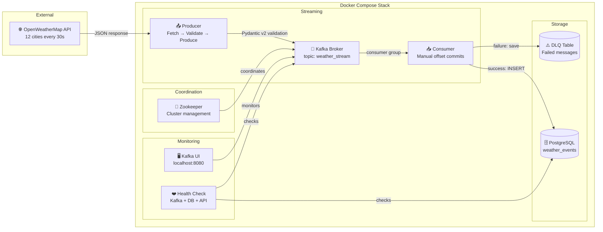

# ⚡ Real-time Weather Streaming Pipeline


A production-grade real-time data streaming pipeline built with Apache Kafka. A Python producer continuously fetches live weather data from the OpenWeatherMap API, validates every record with Pydantic v2, and streams it into a Kafka topic. A decoupled Python consumer reads from the topic, processes each message, and persists clean records into PostgreSQL, with full offset tracking, dead letter queue handling, structured logging, health checks and unit tests throughout.

Built as part of my Data Engineering portfolio to demonstrate real-time streaming architecture, data quality enforcement, and production engineering practices.

---

## 📐 Architecture




### Data Flow

1. **Producer** fetches live weather data every 30 seconds for 12 cities across 6 continents
2. Every record is **validated by Pydantic v2** — invalid data never enters Kafka
3. Valid records are **streamed to Kafka** using city name as the message key — preserving order per city
4. **Consumer** reads messages with manual offset commits — offsets only committed after successful PostgreSQL insertion
5. Failed messages are routed to the **Dead Letter Queue** table for investigation and reprocessing
6. **Kafka UI** at localhost:8080 provides visual monitoring of topics, partitions and messages
---

## 🛠️ Tech Stack

| Layer | Technology | Version | Purpose |
|---|---|---|---|
| Message Broker | Apache Kafka | 3.5 | Real-time message streaming |
| Coordination | Zookeeper | 7.5.0 | Kafka cluster management |
| Monitoring UI | Kafka UI | Latest | Visual topic and message monitoring |
| Validation | Pydantic v2 | 2.5.3 | Strict schema enforcement |
| Database | PostgreSQL | 15 | Persistent event storage |
| Containerization | Docker Compose | Latest | Full stack orchestration |
| Language | Python | 3.11 | Pipeline logic |
| DB Interface | SQLAlchemy | 1.4.51 | Connection pooling and queries |
| Testing | pytest | 7.4.4 | Unit tests |
| External API | OpenWeatherMap | REST | Live weather data source |

---

## ✨ Key Features

- **Real-time streaming** — Kafka producer polls every 30 seconds, consumer processes continuously
- **12 cities across 6 continents** — Paris, London, Berlin, New York, Tokyo, Douala, Lagos, Sydney, Nairobi, São Paulo, Dubai, Mumbai
- **Pydantic v2 validation** — temperature range, humidity bounds, wind speed, required fields all enforced before data enters Kafka
- **Manual offset commits** — offsets committed only after successful DB insertion — no message lost on crash
- **Dead Letter Queue** — failed messages stored with full error detail for investigation and reprocessing
- **Kafka offset tracking** — every PostgreSQL record linked to its exact Kafka message
- **Graceful shutdown** — SIGINT/SIGTERM handled cleanly, in-flight messages completed before exit
- **Structured logging** — consistent format across all modules with INFO/WARNING/ERROR/CRITICAL levels
- **Health check module** — verifies Kafka broker, PostgreSQL and API status on demand
- **Connection pool** — SQLAlchemy pool with pre-ping to handle long-running consumer connections
- **20+ pytest unit tests** — covering schema validation, producer logic and consumer processing
- **Separate Dockerfiles** — producer and consumer have minimal, independent images
- **Makefile** — one-command shortcuts for up, down, restart, logs, status, test and clean
- **CI/CD** — GitHub Actions runs tests automatically on every push

## 📊 Pipeline Metrics

| Metric | Value |
|---|---|
| Cities tracked | 12 across 6 continents |
| Continents covered | Europe, Americas, Asia, Africa, Oceania, Middle East |
| Producer poll interval | Every 30 seconds |
| Messages streamed | 2,207+ (verified in live run) |
| DLQ failures | 0 — perfect reliability |
| Kafka topic | weather_stream |
| Consumer group | weather_consumer_group |
| Unit tests | 20+ passing |
| CI status | GitHub Actions — passing |
| Docker containers | 8 — Zookeeper, Kafka, Kafka UI, PostgreSQL, Producer, Consumer, API, Dashboard |
| Setup command | make up |

---

## 📁 Project Structure

```
kafka-streaming-pipeline/
│
├── config/
│   └── config.yaml               # All settings — Kafka, API, DB, cities, logging
│
├── src/
│   ├── utils/
│   │   └── logger.py             # Structured logger — consistent format, file + console output
│   └── validation/
│       └── schema.py             # Pydantic v2 models — WeatherData and WeatherDataDB
│
├── producer/
│   └── weather_producer.py       # Fetch → Validate → Produce to Kafka with retry logic
│
├── consumer/
│   ├── weather_consumer.py       # Consumer group, manual offset commits, graceful shutdown
│   └── processor.py             # Validate → Deduplicate → Insert to PostgreSQL → DLQ on failure
│
├── monitoring/
│   └── health_check.py          # Checks Kafka, PostgreSQL and API health with latency metrics
│
├── scripts/
│   └── init_db.sql              # Creates DB, user, weather_events table, DLQ table, indexes
│
├── tests/
│   ├── test_schema.py           # 16 tests — valid data, invalid data, edge cases
│   ├── test_producer.py         # Tests fetch, validate, produce with mocked dependencies
│   └── test_consumer.py         # Tests process_message and save_to_dlq with mocked DB
│
├── Dockerfile.producer           # Minimal Python 3.11-slim image for producer
├── Dockerfile.consumer           # Minimal Python 3.11-slim image for consumer
├── docker-compose.yml            # Zookeeper + Kafka + Kafka UI + PostgreSQL + Producer + Consumer
├── requirements.txt              # Pinned Python dependencies
├── .env.example                  # Environment variable template — safe to commit
├── Makefile                      # Shortcuts — make up, down, restart, logs, status, test, clean
├── .gitignore                    # Excludes .env, logs, cache, data
└── README.md
```

---

## 🗄️ Database Schema

```sql
-- Main events table
CREATE TABLE weather_events (
    id                   SERIAL PRIMARY KEY,
    city                 VARCHAR(100)  NOT NULL,
    country              VARCHAR(10)   NOT NULL,
    temperature          FLOAT         NOT NULL,
    feels_like           FLOAT         NOT NULL,
    humidity             INTEGER       NOT NULL CHECK (humidity >= 0 AND humidity <= 100),
    pressure             INTEGER       NOT NULL CHECK (pressure >= 800 AND pressure <= 1100),
    weather_description  VARCHAR(255)  NOT NULL,
    wind_speed           FLOAT         NOT NULL CHECK (wind_speed >= 0),
    visibility           INTEGER       DEFAULT 0,
    recorded_at          TIMESTAMP     NOT NULL,
    inserted_at          TIMESTAMP     DEFAULT CURRENT_TIMESTAMP,
    kafka_offset         BIGINT,       -- Full Kafka message traceability
    kafka_partition      INTEGER
);

-- Dead Letter Queue table
CREATE TABLE weather_events_dlq (
    id            SERIAL PRIMARY KEY,
    raw_message   TEXT          NOT NULL,
    error_type    VARCHAR(100)  NOT NULL,
    error_detail  TEXT          NOT NULL,
    kafka_topic   VARCHAR(255),
    kafka_offset  BIGINT,
    failed_at     TIMESTAMP     DEFAULT CURRENT_TIMESTAMP
);
```

---

## 🚀 How to Run

### Prerequisites

- [Docker Desktop](https://www.docker.com/products/docker-desktop/) installed and running
- Free API key from [OpenWeatherMap](https://openweathermap.org/api)

### Step-by-step

**1. Clone the repository**

```bash
git clone https://github.com/OjongBessongNKONGHO/kafka-streaming-pipeline.git
cd kafka-streaming-pipeline
```

**2. Configure environment variables**

```bash
cp .env.example .env
# Add your OpenWeatherMap API key to .env
```

**3. Start infrastructure**

```bash
docker-compose up zookeeper kafka postgres -d
```

**4. Launch producer and consumer**

```bash
docker-compose up producer consumer kafka-ui --build -d
```

**5. Monitor the pipeline**

| Tool | URL | Purpose |
|---|---|---|
| Kafka UI | http://localhost:8080 | Visual topic and message monitoring |
| Producer logs | `docker logs weather_producer -f` | Live producer output |
| Consumer logs | `docker logs weather_consumer -f` | Live consumer output |

**6. Query the data**

```bash
docker exec -it postgres_streaming psql -U streaming_user -d weather_streaming \
  -c "SELECT city, temperature, weather_description, kafka_offset, recorded_at FROM weather_events ORDER BY recorded_at DESC LIMIT 20;"
```

**7. Run health check**

```bash
docker exec -it weather_producer python -m monitoring.health_check
```

**8. Run tests**

```bash
pip install -r requirements.txt
pytest tests/ -v
```

---

## 🧠 Key Engineering Decisions

**Why Kafka instead of direct DB writes?**
Kafka decouples the producer from the consumer. The producer streams at its own speed. The consumer processes at its own speed. If the database goes down, Kafka holds messages safely until the consumer recovers — no data loss. This is impossible with direct writes.

**Why manual offset commits?**
With auto-commit, Kafka marks a message as processed the moment it is received — before the DB write. If the consumer crashes between receiving and writing, the message is lost forever. Manual commits ensure we only mark a message as processed after it has been successfully written to PostgreSQL.

**Why Pydantic v2 for validation?**
Pydantic validates at the entry point — before data enters Kafka. Invalid data is caught and logged immediately with a precise error message. Without this, bad data would flow all the way to the database before failing, making debugging much harder. This is the fail-fast principle.

**Why a Dead Letter Queue?**
In production, some messages will always fail — malformed data, transient DB errors, schema mismatches. Without a DLQ, those messages are lost forever. With a DLQ, every failure is recorded with the raw message and full error detail, allowing investigation and reprocessing without data loss.

**Why city as the Kafka message key?**
Kafka uses the message key to determine which partition to send to. Using city as the key ensures all messages for Paris always go to the same partition, preserving message order per city. This matters when the consumer needs to process events in chronological order per location.

**Why separate Dockerfiles for producer and consumer?**
Each service only contains the code it needs. The producer image has no consumer code and vice versa. Smaller images, cleaner separation, reduced attack surface. This mirrors how microservices are deployed in production.

---

## 👤 Author

**Ojong Bessong NKONGHO**
Data Engineering Student — DSTI School of Engineering, Paris
Seeking Data Engineering internship (July 2026) & apprenticeship (September 2026)

[](https://linkedin.com/in/nkongho-ojong)
[](https://github.com/OjongBessongNKONGHO)
