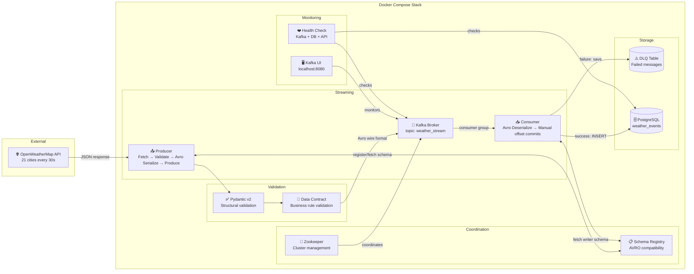

# ⚡ Real-time Weather Streaming Pipeline


A production-grade real-time data streaming pipeline built with Apache Kafka. A Python producer continuously fetches live weather data from the OpenWeatherMap API, validates every record with Pydantic v2 and a data contract, serializes it in Confluent Avro wire format, and streams it into a Kafka topic backed by a Confluent Schema Registry enforcing BACKWARD compatibility. A decoupled Python consumer reads from the topic, deserializes using the schema ID embedded in each message, processes each record, and persists clean data into PostgreSQL — with full offset tracking, dead letter queue handling, structured logging, health checks and 93 unit tests throughout.

Built as part of my Data Engineering portfolio to demonstrate real-time streaming architecture, schema evolution, data quality enforcement, and production engineering practices.

---

## 📐 Architecture



### Data Flow

1. **Producer** fetches live weather data every 30 seconds for 21 cities across 6 continents
2. Every record is **validated by Pydantic v2** — structural validation before data enters the pipeline
3. The **data contract** enforces business rules — temperature within earthly range, humidity as a percentage, timestamps not in the future
4. Valid records are **serialized to Confluent Avro wire format** — a 5-byte header (magic byte + schema ID) followed by Avro-encoded payload
5. The **Schema Registry** enforces BACKWARD compatibility — breaking schema changes are rejected before they reach consumers
6. Valid records are **streamed to Kafka** using city name as the message key, preserving order per city
7. **Consumer** reads messages, extracts the schema ID from the wire format header, fetches the writer schema from the registry (cached after first fetch), and deserializes the payload
8. Deserialized records are committed to **PostgreSQL** with manual offset commits — offsets only committed after successful insertion
9. Failed messages are routed to the **Dead Letter Queue** for investigation and reprocessing

---

## 🛠️ Tech Stack

| Layer | Technology | Version | Purpose |
|---|---|---|---|
| Message Broker | Apache Kafka | 3.5 | Real-time message streaming |
| Schema Management | Confluent Schema Registry | 7.5.0 | Avro schema versioning and compatibility |
| Serialization | Avro (fastavro) | 1.12.2 | Binary serialization with schema evolution |
| Coordination | Zookeeper | 7.5.0 | Kafka cluster management |
| Monitoring UI | Kafka UI | Latest | Visual topic and message monitoring |
| Validation | Pydantic v2 | 2.5.3 | Strict structural schema enforcement |
| Data Contracts | WeatherDataContract | 1.0.0 | Business rule validation layer |
| Database | PostgreSQL | 15 | Persistent event storage |
| Containerization | Docker Compose | Latest | Full stack orchestration |
| Language | Python | 3.11 | Pipeline logic |
| DB Interface | SQLAlchemy | 1.4.51 | Connection pooling and queries |
| Testing | pytest | 7.4.4 | Unit tests |
| External API | OpenWeatherMap | REST | Live weather data source |

---

## ✨ Key Features

- **Real-time streaming** — Kafka producer polls every 30 seconds, consumer processes continuously
- **Concurrent city fetching** — asyncio and aiohttp fetch all 21 cities simultaneously instead of sequentially, reducing fetch time by ~21x
- **21 cities across 6 continents** — Paris, London, Berlin, New York, Tokyo, Douala, Lagos, Sydney, Nairobi, São Paulo, Dubai, Mumbai and more
- **Avro serialization with Confluent wire format** — every message carries a 5-byte header (magic byte + schema ID) so any Confluent-compatible consumer can deserialize without out-of-band schema coordination
- **Schema Registry with BACKWARD compatibility** — breaking type changes are rejected at registration time, not discovered when consumers fail in production. Schema IDs are cached after first registration so the registry is contacted once per process lifetime, not once per message
- **Data contract validation** — a two-pass validation layer enforces business rules on top of Pydantic's structural checks: temperature within earthly range, humidity 0 to 100%, timestamps not in the future. Carries CONTRACT_VERSION so consumers can detect breaking rule changes
- **Pydantic v2 validation** — temperature range, humidity bounds, wind speed, required fields all enforced before data enters Kafka
- **Manual offset commits** — offsets committed only after successful DB insertion, no message lost on crash
- **Dead Letter Queue with reprocessing and monitoring** — failed messages stored with full error detail; a reprocessing script replays DLQ rows through the same validation logic; a separate read-only monitoring script reports message counts, error breakdowns and oldest unresolved message age
- **AvroDeserializationError routes to DLQ** — if the Schema Registry is temporarily unreachable, affected messages go to the DLQ rather than crashing the consumer
- **Kafka offset tracking** — every PostgreSQL record linked to its exact Kafka message
- **Graceful shutdown** — SIGINT/SIGTERM handled cleanly, in-flight messages completed before exit
- **Structured logging** — consistent format across all modules with INFO/WARNING/ERROR/CRITICAL levels
- **Health check module** — verifies Kafka broker, PostgreSQL and API status on demand
- **93 pytest unit tests** — covering schema validation, Avro serialization/deserialization wire format, schema ID caching, producer logic, consumer processing, async concurrent fetching, DLQ reprocessing and monitoring, data contracts
- **Separate Dockerfiles** — producer and consumer have minimal, independent images
- **Makefile** — one-command shortcuts for up, down, restart, logs, status, test and clean
- **CI/CD** — GitHub Actions runs tests automatically on every push

---

## 📊 Pipeline Metrics

| Metric | Value |
|---|---|
| Cities tracked | 21 across 6 continents |
| Continents covered | Europe, Americas, Asia, Africa, Oceania, Australasia |
| Producer poll interval | Every 30 seconds |
| Messages streamed | 2,207+ (verified in live run) |
| DLQ failures | 0 — perfect reliability |
| Kafka topic | weather_stream |
| Consumer group | weather_consumer_group |
| Unit tests | 93 passing |
| CI status | GitHub Actions passing |
| Schema compatibility | BACKWARD enforced via Confluent Schema Registry |
| Setup command | make up |

---

## 📁 Project Structure

```
kafka-streaming-pipeline/
│
├── config/
│   └── config.yaml                   # All settings — Kafka, API, DB, cities, logging
│
├── schemas/
│   ├── weather_v1.avsc               # Baseline Avro schema matching WeatherData model
│   ├── weather_v2_compatible.avsc    # BACKWARD compatible evolution (optional field + default)
│   └── weather_v2_breaking.avsc      # Breaking schema (type change) used to prove registry rejection
│
├── src/
│   ├── avro/
│   │   ├── registry_client.py        # Confluent Schema Registry HTTP client
│   │   ├── serializer.py             # Confluent wire format Avro serializer with schema ID caching
│   │   └── deserializer.py           # Confluent wire format Avro deserializer with writer schema caching
│   ├── contracts/
│   │   └── weather_contract.py       # WeatherDataContract — business rule validation, versioning, batch validation
│   ├── utils/
│   │   └── logger.py                 # Structured logger — consistent format, file + console output
│   └── validation/
│       └── schema.py                 # Pydantic v2 models — WeatherData and WeatherDataDB
│
├── producer/
│   └── weather_producer.py           # Fetch → Validate → Avro serialize → Produce with retry logic
│
├── consumer/
│   ├── weather_consumer.py           # Consumer group, Avro deserialize, manual offset commits, graceful shutdown
│   └── processor.py                  # Validate → Deduplicate → Insert to PostgreSQL → DLQ on failure
│
├── monitoring/
│   └── health_check.py               # Checks Kafka, PostgreSQL and API health with latency metrics
│
├── scripts/
│   ├── init_db.sql                   # Creates DB, user, weather_events table, DLQ table, indexes
│   ├── reprocess_dlq.py              # Reprocesses failed messages from the DLQ back into weather_events
│   └── monitor_dlq.py                # Read-only DLQ health report — message count, error breakdown, oldest unresolved age
│
├── tests/
│   ├── test_schema.py                # 16 tests — valid data, invalid data, edge cases
│   ├── test_producer.py              # Tests fetch, validate, produce with mocked dependencies
│   ├── test_consumer.py              # Tests process_message and save_to_dlq with mocked DB
│   ├── test_async_fetch.py           # Tests concurrent asyncio fetching across all 21 cities
│   ├── test_reprocess_dlq.py         # 9 tests — DLQ reprocessing with mocked engine and process_message
│   ├── test_monitor_dlq.py           # 9 tests — DLQ summary aggregation, age calculation, exit codes
│   ├── test_avro_compatibility.py    # 7 tests — schema registration, BACKWARD compatibility, breaking schema rejection
│   ├── test_avro_serializer.py       # 11 tests — wire format, round-trip, error handling, schema ID caching
│   ├── test_avro_deserializer.py     # 10 tests — wire format parsing, round-trip, caching, registry failure
│   └── test_weather_contract.py      # 19 tests — structural violations, business rules, batch validation
│
├── Dockerfile.producer               # Minimal Python 3.11-slim image for producer
├── Dockerfile.consumer               # Minimal Python 3.11-slim image for consumer
├── docker-compose.yml                # Full stack including Confluent Schema Registry
├── requirements.txt                  # Pinned Python dependencies
├── .env.example                      # Environment variable template — safe to commit
├── Makefile                          # Shortcuts — make up, down, restart, logs, status, test, clean
└── README.md
```

---

## 🗄️ Database Schema

```sql
-- Main events table
CREATE TABLE weather_events (
    id                   SERIAL PRIMARY KEY,
    city                 VARCHAR(100)  NOT NULL,
    country              VARCHAR(10)   NOT NULL,
    temperature          FLOAT         NOT NULL,
    feels_like           FLOAT         NOT NULL,
    humidity             INTEGER       NOT NULL CHECK (humidity >= 0 AND humidity <= 100),
    pressure             INTEGER       NOT NULL CHECK (pressure >= 800 AND pressure <= 1100),
    weather_description  VARCHAR(255)  NOT NULL,
    wind_speed           FLOAT         NOT NULL CHECK (wind_speed >= 0),
    visibility           INTEGER       DEFAULT 0,
    recorded_at          TIMESTAMP     NOT NULL,
    inserted_at          TIMESTAMP     DEFAULT CURRENT_TIMESTAMP,
    kafka_offset         BIGINT,
    kafka_partition      INTEGER
);

-- Dead Letter Queue table
CREATE TABLE weather_events_dlq (
    id            SERIAL PRIMARY KEY,
    raw_message   TEXT          NOT NULL,
    error_type    VARCHAR(100)  NOT NULL,
    error_detail  TEXT          NOT NULL,
    kafka_topic   VARCHAR(255),
    kafka_offset  BIGINT,
    failed_at     TIMESTAMP     DEFAULT CURRENT_TIMESTAMP
);
```

---

## 🚀 How to Run

### Prerequisites

- [Docker Desktop](https://www.docker.com/products/docker-desktop/) installed and running
- Free API key from [OpenWeatherMap](https://openweathermap.org/api)

### Step-by-step

**1. Clone the repository**

```bash
git clone https://github.com/OjongBessongNKONGHO/kafka-streaming-pipeline.git
cd kafka-streaming-pipeline
```

**2. Configure environment variables**

```bash
cp .env.example .env
# Add your OpenWeatherMap API key to .env
# Optionally set SCHEMA_REGISTRY_URL=http://localhost:8081 to enable Avro serialization
```

**3. Start the full stack**

```bash
docker-compose up zookeeper kafka schema-registry postgres -d
```

**4. Launch producer and consumer**

```bash
docker-compose up producer consumer kafka-ui --build -d
```

**5. Monitor the pipeline**

| Tool | URL | Purpose |
|---|---|---|
| Kafka UI | http://localhost:8080 | Visual topic and message monitoring |
| Schema Registry | http://localhost:8081/subjects | Registered Avro schemas |
| Producer logs | `docker logs weather_producer -f` | Live producer output |
| Consumer logs | `docker logs weather_consumer -f` | Live consumer output |

**6. Reprocess failed messages**

```bash
docker exec -it weather_producer python -m scripts.reprocess_dlq
```

**7. Query the data**

```bash
docker exec -it postgres_streaming psql -U streaming_user -d weather_streaming \
  -c "SELECT city, temperature, weather_description, kafka_offset, recorded_at FROM weather_events ORDER BY recorded_at DESC LIMIT 20;"
```

**8. Run health check**

```bash
docker exec -it weather_producer python -m monitoring.health_check
```

**9. Run tests**

```bash
pip install -r requirements.txt
pytest tests/ -v
```

---

## 🧠 Key Engineering Decisions

**Why Kafka instead of direct DB writes?**
Kafka decouples the producer from the consumer. The producer streams at its own speed. The consumer processes at its own speed. If the database goes down, Kafka holds messages safely until the consumer recovers and no data is lost. This is impossible with direct writes.

**Why manual offset commits?**
With auto-commit, Kafka marks a message as processed the moment it is received, before the DB write. If the consumer crashes between receiving and writing, the message is lost forever. Manual commits ensure we only mark a message as processed after it has been successfully written to PostgreSQL.

**Why Pydantic v2 for validation?**
Pydantic validates at the entry point, before data enters Kafka. Invalid data is caught and logged immediately with a precise error message. Without this, bad data would flow all the way to the database before failing, making debugging much harder. This is the fail-fast principle.

**Why a Dead Letter Queue?**
In production, some messages will always fail: malformed data, transient DB errors, schema mismatches. Without a DLQ, those messages are lost forever. With a DLQ, every failure is recorded with the raw message and full error detail, allowing investigation and reprocessing without data loss.

**Why city as the Kafka message key?**
Kafka uses the message key to determine which partition to send to. Using city as the key ensures all messages for Paris always go to the same partition, preserving message order per city. This matters when the consumer needs to process events in chronological order per location.

**Why a standalone reprocessing script instead of automatic retries inside the consumer?**
In-consumer retries handle only failures that resolve within milliseconds, like a single dropped connection. They cannot help with the failures this DLQ actually catches: a database outage lasting minutes, or a schema mismatch that needs a code fix before reprocessing can succeed. A separate script run on demand keeps the consumer simple and fast for the common case, and gives explicit control over when reprocessing happens rather than having a struggling consumer silently retrying in a loop. It reuses `process_message()` directly, so the validation and insertion logic is never duplicated between the live path and the recovery path.

**Why separate Dockerfiles for producer and consumer?**
Each service only contains the code it needs. The producer image has no consumer code and vice versa. Smaller images, cleaner separation, reduced attack surface. This mirrors how microservices are deployed in production.

**Why Avro instead of JSON for message serialization?**
JSON has no schema enforcement. A producer can silently change a field name or type and the consumer will fail at runtime with no warning. Avro binds every message to a versioned schema. The Confluent Schema Registry enforces compatibility rules before a new schema version is accepted: a breaking type change is rejected at registration time, not discovered when consumers start failing in production. Each message carries a 5-byte header containing the schema ID used to encode it, so consumers always know exactly which schema to use for deserialization regardless of when the message was produced.

**Why the Confluent wire format instead of plain Avro bytes?**
Plain Avro bytes embed the full schema in every message or assume the consumer already knows the schema out of band. The Confluent wire format uses a 5-byte header, a magic byte and a 4-byte schema ID, so consumers fetch the schema once from the registry and cache it. A pipeline processing thousands of messages per second fetches each schema version exactly once per process lifetime rather than once per message. Any Confluent-compatible consumer (Spark Structured Streaming, ksqlDB, Kafka Streams) can deserialize messages without any coordination with the producer beyond the registry.

**Why BACKWARD compatibility instead of FULL or FORWARD?**
BACKWARD compatibility means a new schema can read data written with the old schema. This allows consumers to be upgraded before producers, which is the safest migration order in a streaming pipeline where you cannot restart everything simultaneously. Adding an optional field with a default is BACKWARD compatible; removing a required field is not. The registry enforces this automatically. A type change from int to string was rejected by the registry during development, which is exactly the class of bug this catches before it reaches production consumers.

**Why a data contract layer on top of Pydantic validation?**
Pydantic enforces types and structure. The data contract enforces domain meaning. A humidity value of 150 passes Pydantic's integer type check but fails the contract's 0 to 100% rule. A recorded_at timestamp ten minutes in the future passes all structural checks but signals a clock skew bug. The contract catches these at the pipeline entry point, before they reach Kafka, the database, or any downstream consumer. It also carries a version number so consumers can detect breaking changes to the validation rules independently of the Avro schema version.

**Why schema ID caching in both the serializer and deserializer?**
The producer registers its schema once on startup and caches the returned ID. Every subsequent message uses the cached ID with no registry roundtrip. The consumer caches writer schemas by ID after first fetch. In a pipeline running at 21 cities every 30 seconds, this means two registry calls per process lifetime, one on the producer side and one on the consumer side, regardless of how long the pipeline runs or how many messages it processes. Without caching, every message would add an HTTP roundtrip to the registry, multiplying latency linearly with throughput.

**Why AvroDeserializationError routes to the DLQ instead of crashing the consumer?**
If the Schema Registry is temporarily unreachable, a crashing consumer would lose all in-flight messages and require manual restart. By catching AvroDeserializationError and routing affected messages to the DLQ, the consumer continues processing messages that do not require a registry lookup (cached schema IDs) while preserving failed messages for reprocessing once the registry recovers. This keeps the consumer running during transient infrastructure failures rather than amplifying them.
<<<<<<< HEAD

---

## 📦 Portfolio

This is one of six data engineering projects built throughout 2026.

| Project | Stack |
|---------|-------|
| [Weather ETL Pipeline](https://github.com/OjongBessongNKONGHO/weather-etl-pipeline) | Airflow, PostgreSQL, Docker |
| [Kafka Streaming Pipeline](https://github.com/OjongBessongNKONGHO/kafka-streaming-pipeline) (this repo) | Kafka, Avro, Confluent Schema Registry, Pydantic v2, PostgreSQL, Docker |
| [AWS Data Platform](https://github.com/OjongBessongNKONGHO/aws-data-platform) | Terraform, AWS, EC2, RDS, S3, VPC |
| [DuckDB Analytics](https://github.com/OjongBessongNKONGHO/duckdb-analytics) | DuckDB, PyArrow, Click, APScheduler |
| [Spark Streaming Pipeline](https://github.com/OjongBessongNKONGHO/spark-streaming-pipeline) | Spark, Kafka, Delta Lake, dbt, Airflow, Terraform, AWS |
| [Weather API](https://github.com/OjongBessongNKONGHO/weather-api) | FastAPI, PostgreSQL, SQLAlchemy 2.0 async, Prometheus, Grafana, Docker |

=======
>>>>>>> 8544c1817a614780280116d13ab6ffe95b6d693b
---

## 👤 Author

**Ojong Bessong NKONGHO**
<<<<<<< HEAD
BSc Computer Science, DSTI School of Engineering, Paris
MSc Data Engineering and AI — September 2026
=======
Data Engineering Student — DSTI School of Engineering, Paris
Seeking Data Engineering internship immediately & apprenticeship (September 2026)
>>>>>>> 8544c1817a614780280116d13ab6ffe95b6d693b

[](https://linkedin.com/in/nkongho-ojong)
[](https://github.com/OjongBessongNKONGHO)
